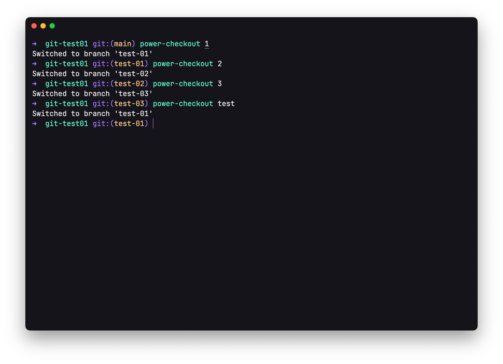

# power checkout

quickly switch to another branch



## install

```bash
npm install -g power-checkout
```

## usage

Switch to the specified branch, first match exactly, secondly match the branch containing the matching string.

If it is -, switch recently used branch.

```bash
power-checkout <string>
```
